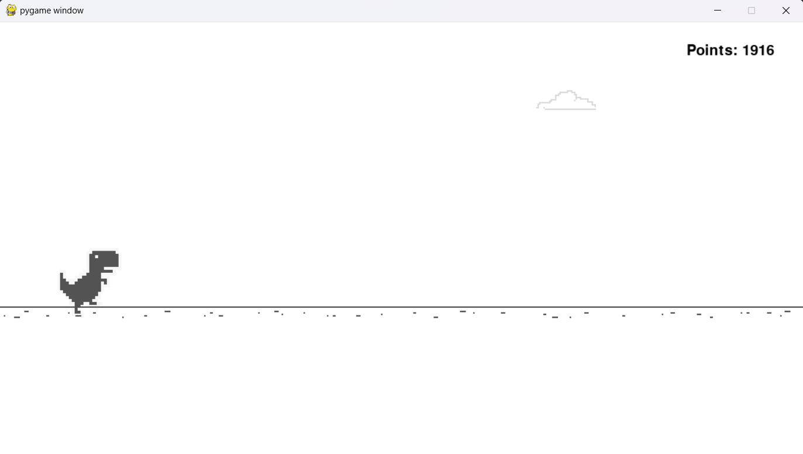

# Useless Dino Game

This is a humorous, "useless" twist on the classic Chrome Dinosaur game. Our version takes a fun spin on the obstacles—whenever the dinosaur runs into one, it humorously "throws" the obstacle away instead of causing the game to end. This project is made by **Shadil AM** and **Abhiram PS**.

## Game Overview

The game uses **Pygame** to simulate a side-scrolling environment where a dinosaur can:
- Run, jump, or duck to avoid obstacles like cacti and birds.
- When the dinosaur collides with an obstacle, it doesn’t lose. Instead, it displays a funny message, and the game keeps going!

For this project, we’ve also included screenshots, a sample video, and necessary assets in the `gallery` folder.

## Getting Started

### Installation

To run the game, ensure that Python and Pygame are installed.

1. **Install Python:** Download and install Python from [Python's official site](https://www.python.org/downloads/).
2. **Install Pygame:** Use the following command to install the Pygame library:
   ```bash
   pip install pygame
   ```

### How to Run the Game

1. Clone this repository and navigate to the project folder.
2. Ensure all assets are in the correct directories (images in `Assets/`, and so on).
3. Run the main game file:
   ```bash
   python main.py
   ```

## Features

- **Humorous Obstacle Collisions:** Each time the dinosaur collides with an obstacle, a randomly chosen humorous message is displayed.
- **Running, Jumping, Ducking:** The dinosaur has full control to either run, jump, or duck.
- **Endless Gameplay:** The game continuously runs until the player decides to quit, with new obstacles appearing at random intervals.

## Screenshots

Here are some screenshots from the game:




## Demo Video

Check out the demo video of the game:
[Watch the Demo Video](gallery/uselessdinogame.mp4)


## Team Information

- **Shadil AM**
- **Abhiram PS**


## Code Documentation

The following is a brief overview of the code structure:

1. **Dinosaur Class**: Handles the dinosaur character's actions (running, jumping, and ducking) and animations.
2. **Cloud Class**: Adds a cloud animation in the background, moving from right to left.
3. **Obstacle Class and Subclasses**: The base `Obstacle` class and its child classes (`SmallCactus`, `LargeCactus`, `Bird`) create obstacles with specific properties.
4. **Main Function**: The game loop is controlled here, with functions to update the dinosaur and obstacles, render the background, display the score, and handle user input.
5. **Menu Function**: Displays the start or restart screen based on the player's death count.

## License

This project is open for any use or modification. Enjoy the fun!


